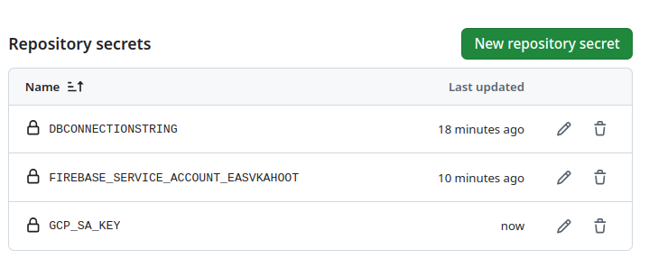

## Adding credentials to deploy to google cloud run


### Step 1) Find the service account EMAIL. You can list available accounts with gcloud CLI:
```bash
gcloud iam service-accounts list
```

if you don't have a service account, you can create one with:

```bash
gcloud iam service-accounts create YOUR_SERVICE_ACCOUNT_NAME   
```
if you don't have necessary roles for service accounts: 
```bash
gcloud projects add-iam-policy-binding YOUR_PROJECT_ID --member=serviceAccount:YOUR_SERVICE_ACCOUNT_NAME@YOUR_PROJECT_ID.iam.gserviceaccount.com --role=roles/cloudrun.admin
gcloud projects add-iam-policy-binding YOUR_PROJECT_ID --member=serviceAccount:YOUR_SERVICE_ACCOUNT_NAME@YOUR_PROJECT_ID.iam.gserviceaccount.com --role=roles/iam.serviceAccountUser     
```


### Step 2) Generate the GCP_SA_KEY as "key.json" file:
```bash
gcloud iam service-accounts keys create key.json --iam-account YOUR_SERVICE_ACCOUNT_EMAIL
```


Use the key.json file contents as a repo secret: (here named GCP_SA_KEY)



## Adding DB connectionstring for a Postgres DB

### Step 1: Get conn string from provider

Example: Aiven's "Overview" for free postgres:


### Step 2: Transform into EF format:

https://rpede.github.io/connection_strings/

Put the EF format string into repository secret named DBCONNECTIONSTRING

### Step 3: Profit