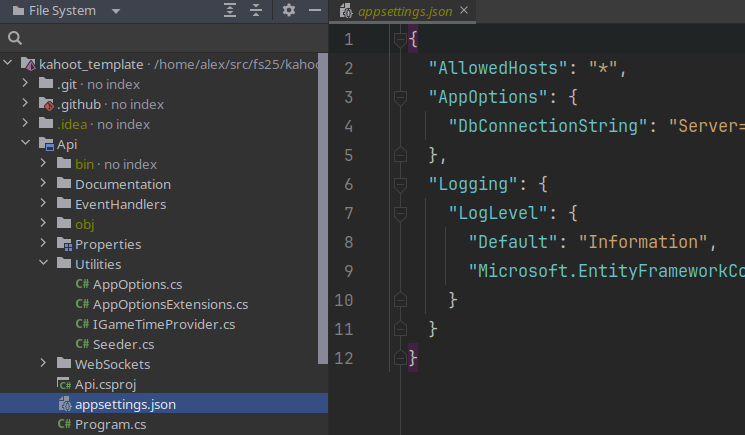

## Adding DB connectionstring for a Postgres DB

### Step 1: Get conn string from provider

Example: Aiven's "Overview" for free postgres:


### Step 2: Transform into EF format:

https://rpede.github.io/connection_strings/


### Step 3: Use it


For local development, put it in a gitignored appsettings.json (make the file with AppOptions scope):



For deployment, put the EF format string into repository secret named DBCONNECTIONSTRING


The attached yml files in .github/workflows/ automatically look for repo secret named DBCONNECTIONSTRING.

## Adding credentials to deploy to google cloud run (GCP_SA_KEY)

### Step 1) Find the service account EMAIL. You can list available accounts with gcloud CLI:
```bash
gcloud iam service-accounts list
```

if you don't have a service account, you can create one with:

```bash
gcloud iam service-accounts create YOUR_SERVICE_ACCOUNT_EMAIL 
```
if you don't have necessary roles for service accounts: 
```bash
gcloud projects add-iam-policy-binding YOUR_PROJECT_ID --member=serviceAccount:YOUR_SERVICE_ACCOUNT_NAME@YOUR_PROJECT_ID.iam.gserviceaccount.com --role=roles/cloudrun.admin
gcloud projects add-iam-policy-binding YOUR_PROJECT_ID --member=serviceAccount:YOUR_SERVICE_ACCOUNT_NAME@YOUR_PROJECT_ID.iam.gserviceaccount.com --role=roles/iam.serviceAccountUser     
```


### Step 2) Generate the GCP_SA_KEY as "key.json" file:
```bash
gcloud iam service-accounts keys create key.json --iam-account YOUR_SERVICE_ACCOUNT_EMAIL
```

Use the generated key.json file contents as a repo secret: (here named GCP_SA_KEY)


Once this is configured, we can deploy using the gcloud.yml file in .github/workflows. 
*(It uses the Dockerfile in the root directory to publish an image.)*


## Adding your own production URL to your WebSocket API

You can always find your production URL on cloud run: (dont forget to switch https and wss)


Then in /client/.env.production swap the value to your gcloud run deployment URL (currently using my own)

```
VITE_API_BASE_URL=wss://kahoot-267099996159.europe-north1.run.app
```


It will be used in App.tsx like this:


.env.development uses localhost:8080 - you can change this if you'd like.


## Adding Firebase token

I recommend starting out by removing /client/.firebaserc and /client/firebase.json.

Then use the firebase CLI (npm i firebase-tools) to add CI/CD with this command: 

```
firebase init hosting
```
Remember to say yes to CI/CD and configure the "public" path to the "dist" folder in the "client" directory (where vite will output the build when running npm run build). The paths in the firebase yml file for Github Actions should also be accordingly (you can check mine for reference).